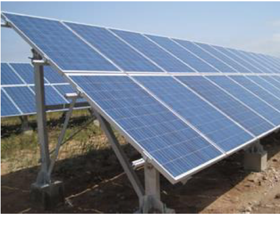
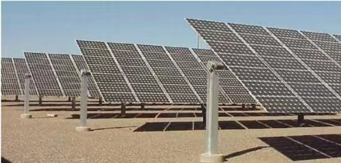
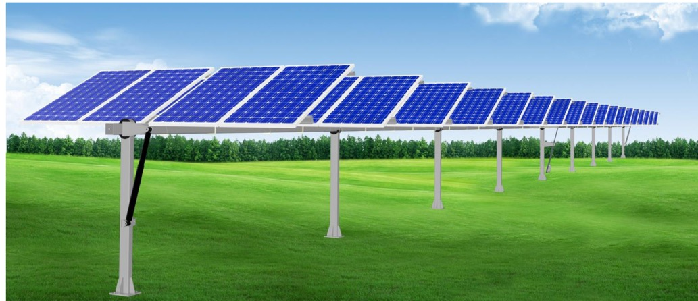
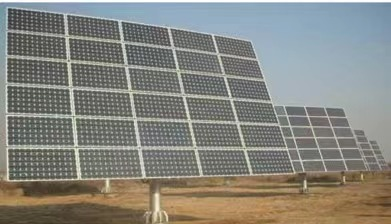

# 光伏阵列

### 光伏阵列的安装方式

### 固定支架

光伏阵列不随太阳的入射角变化而转动，以固定的方式接受太阳辐射。根据倾角设定情况可以分为：最佳倾角固定式，斜屋面倾角固定式，倾角可调固定式。

**最佳倾角固定式：**

需要先计算出当地最佳安装倾角，目前在平顶屋面电站和地面电站使用广泛。

**斜屋面倾角固定式**：

根据斜屋面的不同，可分为瓦片屋顶安转系统和轻钢屋顶安装系统。

**倾角可调固定式**：

在太阳入射角变化转折点，定期调节固定支架倾角，增加太阳光的直射吸收，在略增加成本的情况下提高发电量。

<figure><figcaption></figcaption></figure>

**平单轴跟踪系统：**

光伏方阵随着一根水平轴东西方向跟踪太阳，来获得较大的发电量，广泛应用于低纬度地区

<figure><figcaption></figcaption></figure>

**斜单轴跟踪系统：**

追踪轴在东西方向转动的同时向南设置一定的倾角，围绕该倾斜轴追踪太阳方位角。来获取等大的发电量，适合应用于高纬度地区

<figure><figcaption></figcaption></figure>

**双轴跟踪系统：**

使用两根轴转到，来实现对太阳的实时跟踪，以保证每一个时刻太阳光线都源于组件板面垂直，以此来获得最大的发电量，适合在各个维度地区使用。

<figure><figcaption></figcaption></figure>

#### 总结

* 纬度越低的地方，平铺时发电量损失越少；
* 纬度越高的地方，垂直时发电量损失越少

### 什么是最佳安装倾角

狭义上说，若固定式光伏方阵在该倾角下倾斜面所接收到的年总辐射量最大，则称该倾角为[最佳倾角](https://www.sohu.com/a/395358392\_408441)

在离网光伏发电系统的方阵最佳倾角按照最低辐射度月份倾斜面上受到较大辐射量来选取。推荐方阵倾角在当地纬度的基础上再增加5°\~ 15。

并网光伏发电系统的方阵最佳倾角按照全年发电量( 或辐射量)最优来选取。倾角等于当地纬度时可常使全年在方阵表面上的太阳辐射能达到最大，全年发电量也最大。

光伏水泵系统的方阵最佳倾角按照夏天发电量( 或辐射量 )最优来选取。倾角等于当地纬度减小5°\~15°时可常使夏天在方阵表面上的太阳辐射能达到最大，发电量也最大。

还有一些特殊情况：对于安装在屋顶上的光伏方阵，其倾角就等于屋顶的倾角，对于安装在建筑物正面的光伏方阵，其倾角等于90°。在积雪地带，应设定45°以上的角度，从而使20 \~ 30cm厚的积雪依靠自重滑落。

